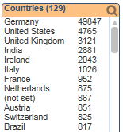
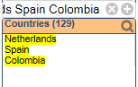

QlikView Extension ListboxSearchPaste
=====================================

This document extension changes the behavior of pasting multi-line multiple values (a list with line breaks) into the listbox search popup input field. 
For IE and QlikView Desktop it is not possible by default to paste in a list of multi-line multiple values (eg. from Excel sheet). Only the first value will be selected.
This extension replaces the line breaks in the pasted string with spaces so multiple values can easily be selected.

