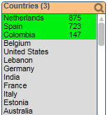

QlikView Extension ListboxSearchPaste
=====================================

This document extension changes the behavior of pasting multiple values (a list with line break) into the listbox search popup input field. 
For IE and QlikView Desktop it is not possible by default to paste in a list of multi-line values (eg. from Excel sheet). Only the first value is selected.
This extension will replace the line breaks with spaces so multiple values can easily be selected.

